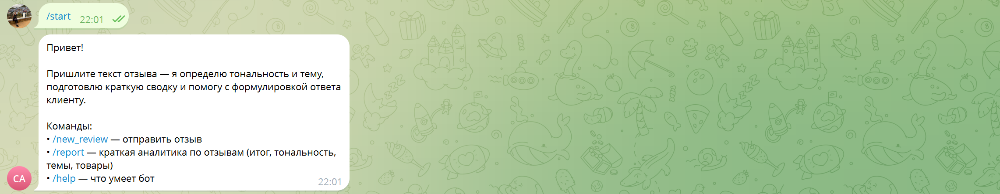
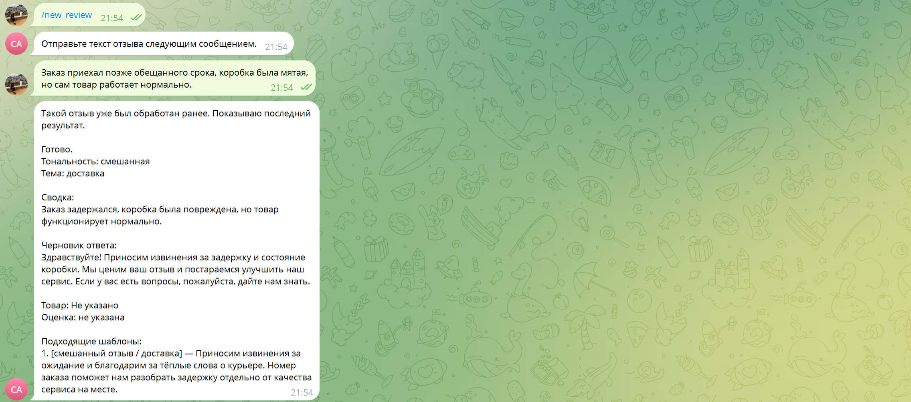
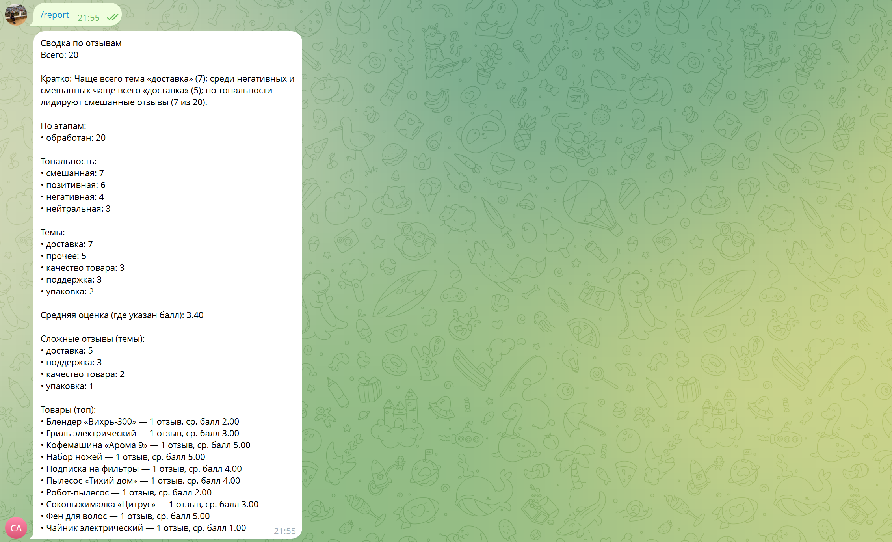
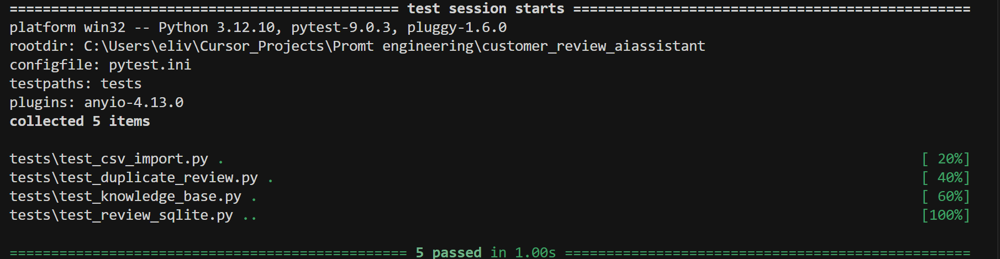
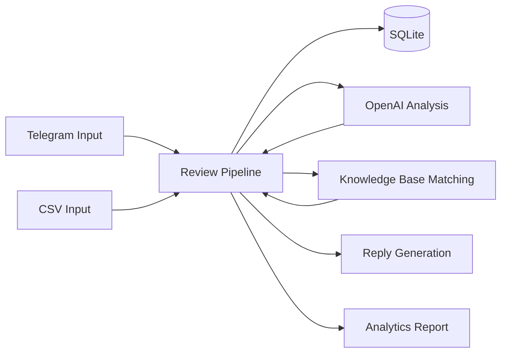

# Customer Review AI Assistant

**English Summary**  
Portfolio project: AI assistant for customer feedback processing in Telegram.  
It ingests reviews, stores them in SQLite, analyzes sentiment/topic with OpenAI, and drafts reply suggestions.  
The assistant also matches relevant templates from a CSV knowledge base and builds a compact analytics report.  
Tech stack: Python, aiogram, SQLite, OpenAI API, pytest.  
Suitable for support teams, quality control, and fast first-line feedback triage.

---

AI-ассистент для обработки клиентских отзывов в Telegram: от входящего текста до структурированного результата для оператора.  
Проект помогает быстро разбирать обратную связь, определять тональность и тему, готовить черновик ответа и получать компактную аналитику по накопленным отзывам.

Высокоуровневый стек: **Python 3.11+, aiogram, SQLite, OpenAI API, CSV knowledge base, pytest**.

---

## Демо

**01 Start screen**  


**02 Review processing result**  


**03 Analytics report**  


**04 Tests / quality check**  


---

## Problem / Solution / Value

- **Problem:** входящие отзывы разнородны, требуют ручной классификации и замедляют работу поддержки/качества.
- **Solution:** бот автоматически выделяет тональность и тему, формирует краткую суть, черновик ответа и подбирает релевантные шаблоны из базы знаний.
- **Value:** меньше времени на первичный разбор, единый формат ответов, прозрачная мини-аналитика по отзывам через `/report`.

---

## Архитектура



Пайплайн проекта: **Telegram / CSV -> SQLite -> OpenAI -> knowledge base -> reply / report**.

---

## Пример входа и результата

**Входной отзыв (пример):**  
`"Заказ задержали на два дня, но оператор помог и всё объяснил."`

**Результат обработки (кратко):**
- **Тональность:** `mixed`
- **Тема:** `delivery`
- **Суть:** задержка доставки при позитивной оценке работы оператора
- **Черновик ответа:** вежливое извинение за задержку + благодарность за обратную связь
- **Подходящие шаблоны knowledge base:** `mixed/delivery`, `complaint/delivery`

---

## Что умеет проект

- принимать и обрабатывать отзывы через Telegram-бота;
- импортировать отзывы из CSV без изменения структуры данных;
- классифицировать отзывы по тональности и теме;
- формировать краткую сводку по каждому отзыву;
- генерировать черновик ответа клиенту;
- подбирать релевантные шаблоны из базы знаний;
- формировать компактный аналитический отчёт по команде `/report`;
- предотвращать дубли при повторной отправке одинакового отзыва.

---

## Качество и надежность

- **pytest-автотесты:** базовые проверки для SQLite, дедупликации, CSV-импорта и подбор шаблонов из knowledge base.
- **Защита от дублей:** повторный отзыв от того же источника и с тем же текстом не приводит к повторной обработке.
- **Тестовые данные:** в репозитории есть тестовые CSV и база знаний для воспроизводимых проверок.
- **Документация:** отдельные материалы в `docs/` по сценариям, аналитике и обновлению проекта.
- **Модульная структура:** сервисы разделены по зонам ответственности (пайплайн, БД, KB, отчёты, Telegram).

Ключевые сценарии, покрытые тестами: SQLite CRUD, защита от дублей, импорт CSV, matching с knowledge base.

---

## Стек технологий

| Компонент | Технология |
|-----------|------------|
| Язык | Python 3.11+ |
| Интерфейс | Telegram Bot API, **aiogram** |
| Хранение | **SQLite** (`sqlite3`) |
| ИИ | **OpenAI API** |
| Конфигурация | **python-dotenv** |
| База знаний | CSV (`data/knowledge_base.csv`) |
| Тесты | **pytest** |

---

## Структура проекта

```text
├── README.md
├── requirements.txt
├── pytest.ini
├── .env.example
├── main.py
├── config.py
├── prompts.py
├── bot/
│   ├── handlers.py
│   ├── runner.py
│   └── messages.py
├── services/
│   ├── ai_service.py
│   ├── review_service.py
│   ├── review_pipeline.py
│   ├── csv_service.py
│   ├── knowledge_base_service.py
│   ├── localization_service.py
│   └── report_service.py
├── data/
│   ├── reviews.db            # runtime SQLite-файл, создаётся при запуске по пути из `.env`
│   └── knowledge_base.csv
├── samples/
│   └── sample_reviews.csv
├── tests/
│   ├── conftest.py
│   ├── test_review_sqlite.py
│   ├── test_duplicate_review.py
│   ├── test_csv_import.py
│   └── test_knowledge_base.py
├── assets/
│   ├── 01_start_screen.png
│   ├── 02_review_processing.png
│   ├── 03_analytics_report.png
│   └── 04_pytest_results.png
└── docs/
    ├── assistant_prompt_for_docs.md
    ├── scenarios_for_docs.md
    ├── examples_qa.md
    ├── analytics_examples.md
    └── update_guide.md
```

---

## Установка зависимостей

1. Установите **Python 3.11+**.
2. Создайте виртуальное окружение:

   ```bash
   python -m venv .venv
   ```

3. Активируйте его:
   - **Windows (PowerShell):** `.\.venv\Scripts\Activate.ps1`
   - **macOS / Linux:** `source .venv/bin/activate`

4. Установите пакеты:

   ```bash
   pip install -r requirements.txt
   ```

---

## Тесты (pytest)

Из корня проекта (с активированным venv):

```bash
pytest
```

`pytest.ini` подключает корень репозитория к импорту модулей (`pythonpath = .`).

---

## Настройка `.env`

1. Скопируйте `.env.example` в файл `.env` в корне проекта.
2. Заполните переменные:

| Переменная | Назначение |
|------------|------------|
| `TELEGRAM_BOT_TOKEN` | токен от @BotFather для работы бота |
| `OPENAI_API_KEY` | ключ OpenAI для анализа отзывов |
| `OPENAI_MODEL` | модель (по умолчанию `gpt-4o-mini`) |
| `DATABASE_PATH` | путь к SQLite (по умолчанию `data/reviews.db`) |
| `RUN_SMOKE_TESTS` | `true / 1 / yes / on` — запуск smoke перед ботом |
| `LOG_LEVEL` | уровень логов (`INFO`, `DEBUG`, ...) |

---

## Запуск бота

```bash
python main.py
```

При обычном запуске:
- инициализируется SQLite;
- запускается Telegram-бот (long polling);
- smoke tests не выполняются, если не включён `RUN_SMOKE_TESTS`.

---

## Команды Telegram-бота

| Команда | Назначение |
|---------|------------|
| `/start` | краткое описание бота |
| `/help` | справка по командам |
| `/new_review` | отправка нового отзыва |
| `/report` | краткий аналитический отчёт |

Любое обычное текстовое сообщение обрабатывается как отзыв.

---

## База знаний (`knowledge_base`)

Файл: `data/knowledge_base.csv`.

Слой базы знаний используется как справочник и добавляет:
- типовые формулировки;
- шаблоны ответов по темам/тональности;
- рекомендации оператору;
- примеры кратких summary.

Шаблоны базы знаний не подменяют результат модели, а дополняют его.

---

## Аналитика (`/report`)

Команда `/report` формирует компактную сводку по данным SQLite:
- общее количество отзывов;
- распределение по статусам;
- распределение по тональности;
- распределение по темам;
- средний рейтинг;
- сложные темы (negative/mixed);
- топ по товарам.

Источники с префиксом `smoke_*` исключаются из пользовательского отчёта.

---

## Как можно адаптировать проект под другие сценарии

1. **Support feedback assistant**  
   Обновить `prompts.py` под SLA/эскалации, расширить `knowledge_base.csv` кейсами поддержки, при необходимости добавить поля тикетов в CSV.

2. **HR pulse / employee feedback assistant**  
   Переписать таксономию тем (например, `onboarding`, `manager`, `culture`), заменить шаблоны ответов на HR-формат, использовать отдельную БД/источник.

3. **Product discovery feedback assistant**  
   Сместить промпт на продуктовые инсайты и боли пользователей, адаптировать KB под feature requests, усилить секцию отчёта по темам и трендам.

4. **Marketplace seller review assistant**  
   Заменить словарь тем на продавец-ориентированные (`delivery`, `returns`, `listing_quality`), добавить шаблоны для публичных ответов в карточках товаров.

5. **Educational feedback assistant**  
   Настроить темы под обучение (`content_quality`, `mentor_support`, `platform`), адаптировать тон ответов под EdTech-коммуникацию, обновить тестовые данные.

---

## Документация проекта

Материалы в `docs/`:
- `assistant_prompt_for_docs.md` — системный промпт, роль, ограничения;
- `scenarios_for_docs.md` — сценарии использования;
- `examples_qa.md` — примеры отзывов и ожидаемых результатов;
- `analytics_examples.md` — примеры аналитики и структура отчёта;
- `update_guide.md` — инструкция по обновлению проекта.

---

## Ограничения

- качество анализа зависит от модели и промпта;
- ответы бота требуют финальной проверки человеком перед отправкой клиенту;
- режим работы Telegram — long polling;
- проект не включает production-инфраструктуру и деплой.
