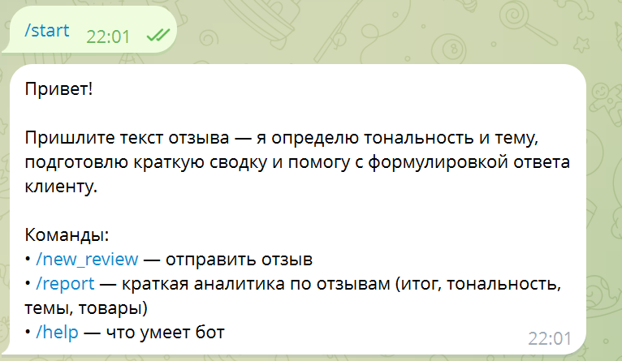
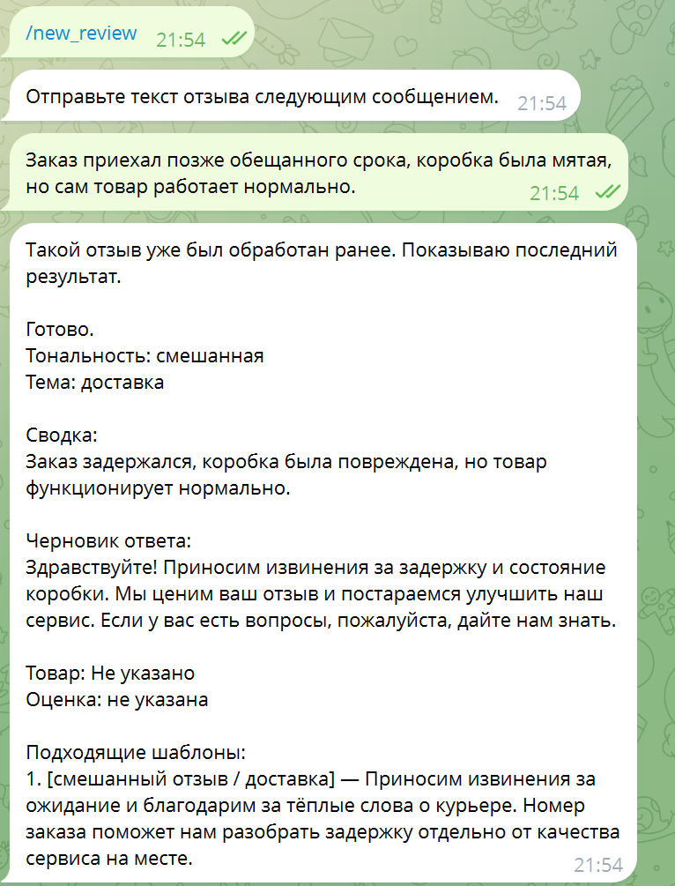
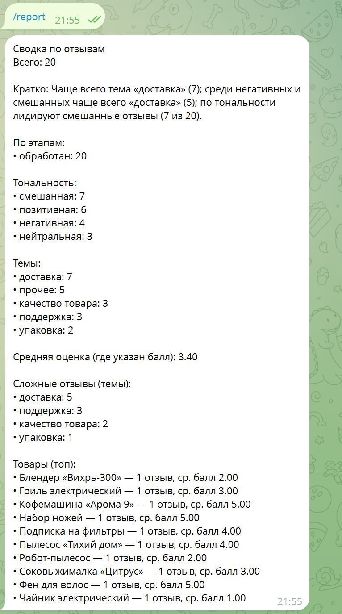
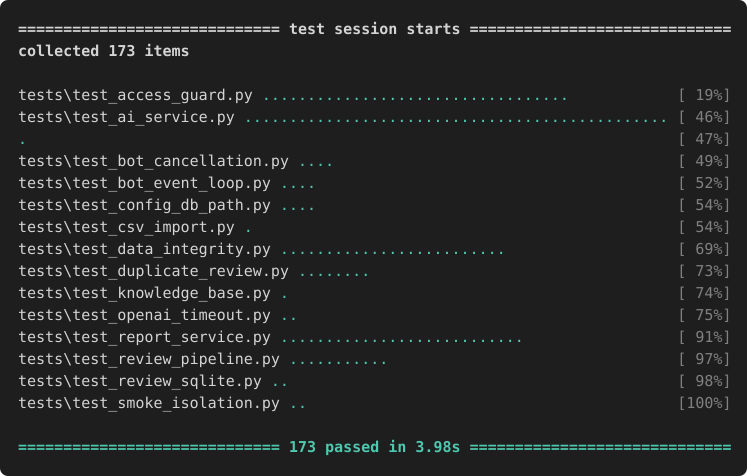
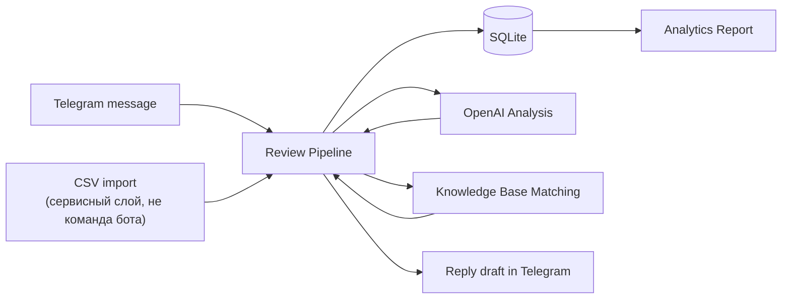

# Customer Review AI Assistant

[](https://github.com/eliv1982/customer-review-ai-assistant/actions/workflows/tests.yml)

**English Summary**  
Portfolio project: a Telegram bot that triages customer feedback. It stores each review in a local SQLite database, analyzes sentiment and topic with the OpenAI API (structured JSON output), drafts a reply for a human operator, suggests matching templates from a CSV knowledge base, and builds a compact analytics report (`/report`).

Tech stack: Python 3.11/3.12, aiogram 3, SQLite, OpenAI API, pytest, GitHub Actions.

It is a local long-polling demo, not a production deployment.

---

AI-ассистент для обработки клиентских отзывов в Telegram: от входящего текста до структурированного результата для оператора.  
Проект помогает быстро разбирать обратную связь, определять тональность и тему, готовить черновик ответа и получать компактную аналитику по накопленным отзывам.

Стек: **Python 3.11 / 3.12, aiogram, SQLite, OpenAI API, CSV knowledge base, pytest, GitHub Actions**.

---

## Демо

**01 Start screen**  


**02 Review processing result**  


**03 Analytics report**  


**04 Tests (вывод `python -m pytest --no-header`, отрисован из реального прогона)**



Скриншоты 01–03 сняты на работающем боте. После них `/start` получил одну строку о хранении данных (см. [Данные и доступ](#данные-и-доступ)).

---

## Быстрый старт

Нужны: **Python 3.11 или 3.12** (обе версии проверяются в CI), токен бота от [@BotFather](https://t.me/BotFather) и ключ OpenAI API.

```bash
git clone https://github.com/eliv1982/customer-review-ai-assistant.git
cd customer-review-ai-assistant
python -m venv .venv
# Windows (PowerShell): .\.venv\Scripts\Activate.ps1
# macOS / Linux:        source .venv/bin/activate
python -m pip install -r requirements.txt
```

Скопируйте `.env.example` в `.env` (`cp .env.example .env`, в Windows — `copy .env.example .env`), впишите `TELEGRAM_BOT_TOKEN` и `OPENAI_API_KEY` и запустите:

```bash
python main.py
```

Запускается long polling; при старте инициализируется SQLite. Без `TELEGRAM_BOT_TOKEN` приложение только инициализирует базу и завершается; без `OPENAI_API_KEY` бот отвечает, что анализ недоступен.

Автотесты (ключи и сеть не нужны):

```bash
python -m pip install -r requirements-dev.txt
python -m pytest
```

---

## Problem / Solution / Value

- **Problem:** входящие отзывы разнородны, требуют ручной классификации и замедляют работу поддержки/качества.
- **Solution:** бот выделяет тональность и тему, формирует краткую суть, черновик ответа и подбирает релевантные шаблоны из базы знаний.
- **Value:** меньше времени на первичный разбор, единый формат ответов, мини-аналитика по отзывам через `/report`.

---

## Архитектура


```mermaid
flowchart LR
    A[Telegram message] --> D[Review Pipeline]
    B["CSV import<br/>(сервисный слой, не команда бота)"] --> D
    D --> C[(SQLite)]
    D --> E[OpenAI Analysis]
    D --> F[Knowledge Base Matching]
    E --> D
    F --> D
    D --> G[Reply draft in Telegram]
    C --> H[Analytics Report]
```

Пайплайн: **Telegram → SQLite → OpenAI → knowledge base → ответ оператору**; `/report` строится по данным SQLite.

---

## Пример входа и результата

> Иллюстрация формата, а не гарантированный вывод: метки и формулировки модели могут отличаться от запроса к запросу.

**Входной отзыв:** `"Заказ задержали на два дня, но оператор помог и всё объяснил."`

**Что бот присылает (формат реальный, значения — пример):**
- **Тональность:** смешанная
- **Тема:** доставка
- **Сводка:** задержка доставки при позитивной оценке работы оператора
- **Черновик ответа:** вежливое извинение за задержку + благодарность за обратную связь
- **Товар / Оценка:** `Не указано` / `не указана` (из Telegram эти поля не собираются)
- **Подходящие шаблоны:** до двух шаблонов из knowledge base с той же темой и тональностью, например `[смешанный отзыв / доставка]`

---

## Что умеет проект

- принимает отзыв в Telegram: любое обычное текстовое сообщение (команда `/new_review` лишь подсказывает, что делать);
- через OpenAI определяет тональность и тему, формирует краткую сводку и черновик ответа клиенту (на русском);
- сохраняет отзыв и результат анализа в локальную SQLite;
- показывает до двух справочных шаблонов из CSV базы знаний;
- строит компактный аналитический отчёт по команде `/report`;
- при повторной отправке **того же текста тем же пользователем в течение 24 часов** возвращает сохранённый результат без нового вызова OpenAI;
- умеет импортировать отзывы из CSV на уровне сервиса (`services/csv_service.py`; используется в smoke-проверке и тестах) — в самом боте загрузки файлов **нет**;
- опционально ограничивает доступ списком Telegram ID (`ALLOWED_TELEGRAM_IDS`).

---

## Данные и доступ

Краткое описание фактического поведения Telegram-версии; это не юридическая политика конфиденциальности.

**Что сохраняется** (локальная SQLite, по умолчанию `data/reviews.db`, файл в `.gitignore`):
- числовой Telegram ID отправителя — в поле `source` в виде `telegram:<id>`; по нему же ищутся дубликаты;
- имя из профиля Telegram (полное имя, а если его нет — `@username`; иначе `Не указано`) — в `customer_name`;
- текст отзыва, статус и время создания;
- результат анализа: тональность, тема, сводка, черновик ответа.

Другие данные профиля или чата приложение не сохраняет. Шифрования, срока хранения, автоматического удаления и команды удаления данных нет — очистка выполняется вручную в SQLite.

**Что отправляется в OpenAI:** системный промпт и **текст отзыва** — для анализа через настроенный OpenAI API. Telegram ID и имя в запрос не входят. Дальнейшая обработка на стороне OpenAI определяется условиями вашего аккаунта OpenAI.

`/start` показывает однострочное уведомление об этом. `/report` — агрегаты по всей базе (не только по отзывам текущего пользователя); текстов отзывов в нём нет.

**Ограничение доступа (`ALLOWED_TELEGRAM_IDS`)** — необязательная настройка деплоя:
- задана, например, как `ALLOWED_TELEGRAM_IDS=111111111,222222222` — ботом пользуются только эти ID; остальные получают «Доступ к этому боту ограничен» до любых обращений к OpenAI и базе (действует для всех команд и обычных сообщений);
- не задана или пуста — доступ открыт для всех;
- некорректное значение (не положительные целые числа) **останавливает запуск с ошибкой**, а не открывает доступ молча.

---

## Качество и тесты

- **173 pytest-теста, полностью офлайн:** OpenAI и Telegram подменены, внешние сетевые соединения блокируются в `tests/conftest.py`, ключи не нужны.
- **Что покрыто:** SQLite и целостность данных, защита от дублей, CSV-импорт, подбор шаблонов KB, отчёты, пайплайн, разбор ответа модели и ошибок OpenAI, таймауты/ретраи клиента, лимит ответа и граница промпта, цикл событий и отмена в хендлерах, `ALLOWED_TELEGRAM_IDS`, путь к БД, изоляция smoke.
- **CI:** GitHub Actions (`.github/workflows/tests.yml`) — Ubuntu, Python 3.11 и 3.12, `python -m pytest`, на каждый push и pull request.
- **Зависимости:** `requirements.txt` (runtime) и `requirements-dev.txt` (+ pytest) с зафиксированными версиями.
- **Защита от дублей:** окно — 24 часа и точное совпадение текста (без учёта пробелов по краям) для одного Telegram-пользователя; по истечении окна отзыв обрабатывается как новый.
- **Модульная структура:** сервисы разделены по зонам ответственности (пайплайн, БД, KB, отчёты, Telegram).

---

## Стек технологий

| Компонент | Технология |
|-----------|------------|
| Язык | Python 3.11 и 3.12 (проверяются в CI) |
| Интерфейс | Telegram Bot API, **aiogram** (long polling) |
| Хранение | **SQLite** (`sqlite3`) |
| ИИ | **OpenAI API** (Chat Completions, structured JSON output; модель по умолчанию `gpt-4o-mini`) |
| Конфигурация | **python-dotenv** |
| База знаний | CSV (`data/knowledge_base.csv`) |
| Тесты / CI | **pytest**, **GitHub Actions** |

---

## Структура проекта

```text
├── README.md
├── LICENSE
├── requirements.txt          # runtime-зависимости
├── requirements-dev.txt      # runtime + pytest
├── pytest.ini
├── .env.example
├── .github/workflows/tests.yml
├── main.py
├── config.py
├── prompts.py
├── bot/
│   ├── handlers.py
│   ├── runner.py
│   └── messages.py
├── services/
│   ├── ai_service.py
│   ├── review_service.py
│   ├── review_pipeline.py
│   ├── csv_service.py
│   ├── knowledge_base_service.py
│   ├── localization_service.py
│   └── report_service.py
├── data/
│   ├── reviews.db            # runtime SQLite-файл, создаётся при запуске по пути из `.env`
│   └── knowledge_base.csv
├── samples/
│   └── sample_reviews.csv    # демо-CSV для smoke-проверки и тестов
├── tests/                    # офлайн-тесты pytest + conftest.py
├── assets/                   # скриншоты для README
└── docs/
    ├── assistant_prompt_for_docs.md
    ├── scenarios_for_docs.md
    ├── examples_qa.md
    ├── analytics_examples.md
    └── update_guide.md
```

---

## Настройка `.env`

Скопируйте `.env.example` в `.env` в корне проекта и заполните переменные:

| Переменная | Назначение |
|------------|------------|
| `TELEGRAM_BOT_TOKEN` | токен от @BotFather; без него бот не запускается |
| `OPENAI_API_KEY` | ключ OpenAI для анализа отзывов |
| `OPENAI_MODEL` | модель (по умолчанию `gpt-4o-mini`) |
| `DATABASE_PATH` | путь к SQLite (по умолчанию `data/reviews.db`; относительный путь отсчитывается от корня проекта, а не от текущей папки) |
| `ALLOWED_TELEGRAM_IDS` | необязательно: числовые Telegram ID через запятую; пусто — доступ для всех (см. [Данные и доступ](#данные-и-доступ)) |
| `RUN_SMOKE_TESTS` | `true / 1 / yes / on` — smoke-проверка перед запуском бота |
| `LOG_LEVEL` | уровень логов (`INFO`, `DEBUG`, ...) |

### Smoke-проверка (необязательно)

`RUN_SMOKE_TESTS=true python main.py` (PowerShell: `$env:RUN_SMOKE_TESTS="true"; python main.py`) перед запуском бота прогоняет импорт `samples/sample_reviews.csv`, отчёт, подбор KB и (только при заданном `OPENAI_API_KEY`) один `process_review`. Всё выполняется на **временной БД**, которая удаляется после проверки: основная база и `/report` не затрагиваются. Если задан `OPENAI_API_KEY`, smoke делает **реальные вызовы OpenAI**. Для автоматической проверки без ключей используйте `python -m pytest`.

---

## Команды Telegram-бота

| Команда | Назначение |
|---------|------------|
| `/start` | краткое описание бота и строка о хранении данных |
| `/help` | справка по командам |
| `/new_review` | подсказка отправить текст отзыва следующим сообщением |
| `/report` | краткий аналитический отчёт |

Любое обычное текстовое сообщение (не команда) обрабатывается как отзыв.

---

## База знаний (`knowledge_base`)

Файл: `data/knowledge_base.csv` (колонки `review_type`, `common_phrase`, `sentiment`, `topic`, `reply_template`, `recommended_action`, `summary_example`).

Подбор идёт по теме и тональности из анализа модели. В Telegram показывается только `reply_template` (до 320 символов, с подписью вида `[тип / тема]`):
- до двух шаблонов с совпадением и по теме, и по тональности;
- если таких нет — не более одного шаблона по той же теме без полярного конфликта с тональностью.

Колонки `recommended_action` и `summary_example` — справочные данные в CSV, бот их сейчас не показывает. Шаблоны не подменяют `reply_draft` модели, а дополняют его.

---

## Аналитика (`/report`)

Команда `/report` формирует компактную сводку по данным SQLite:
- общее количество отзывов;
- распределение по статусам;
- распределение по тональности;
- распределение по темам;
- средний рейтинг (по отзывам, где указан балл; из Telegram оценка не приходит);
- сложные темы (negative/mixed);
- топ по товарам (скрываются записи без названия товара).

Источники с префиксом `smoke_*` исключаются из пользовательского отчёта.

---

## Как можно адаптировать проект под другие сценарии

1. **Support feedback assistant**  
   Обновить `prompts.py` под SLA/эскалации, расширить `knowledge_base.csv` кейсами поддержки, при необходимости добавить поля тикетов в CSV.

2. **HR pulse / employee feedback assistant**  
   Переписать таксономию тем (например, `onboarding`, `manager`, `culture`), заменить шаблоны ответов на HR-формат, использовать отдельную БД/источник.

3. **Product discovery feedback assistant**  
   Сместить промпт на продуктовые инсайты и боли пользователей, адаптировать KB под feature requests, усилить секцию отчёта по темам и трендам.

4. **Marketplace seller review assistant**  
   Заменить словарь тем на продавец-ориентированные (`delivery`, `returns`, `listing_quality`), добавить шаблоны для публичных ответов в карточках товаров.

5. **Educational feedback assistant**  
   Настроить темы под обучение (`content_quality`, `mentor_support`, `platform`), адаптировать тон ответов под EdTech-коммуникацию, обновить тестовые данные.

---

## Документация проекта

Материалы в `docs/`:
- `assistant_prompt_for_docs.md` — системный промпт, роль, ограничения;
- `scenarios_for_docs.md` — сценарии использования;
- `examples_qa.md` — примеры отзывов и ожидаемых результатов;
- `analytics_examples.md` — примеры аналитики и структура отчёта;
- `update_guide.md` — инструкция по обновлению проекта.

---

## Ограничения

- качество анализа зависит от модели и промпта; ответы бота — черновики, их нужно проверять человеку перед отправкой клиенту;
- промпт велит модели не выполнять инструкции из текста отзыва, но это не гарантия защиты от prompt injection;
- один процесс с long polling и локальная SQLite — не рассчитано на высокую нагрузку; ограничения частоты запросов нет;
- нет команды и политики удаления данных (см. [Данные и доступ](#данные-и-доступ));
- интерфейс и результаты — на русском языке;
- проект не развёрнут в production и не включает production-инфраструктуру и деплой.

---

## Лицензия

MIT — см. [LICENSE](LICENSE).
